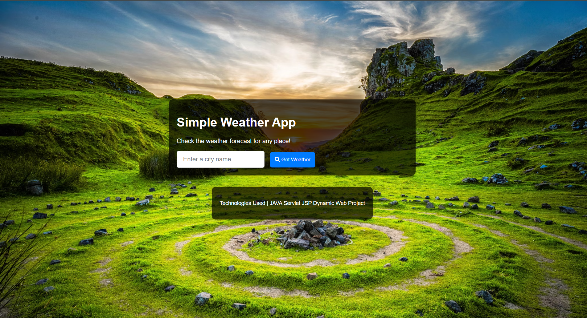
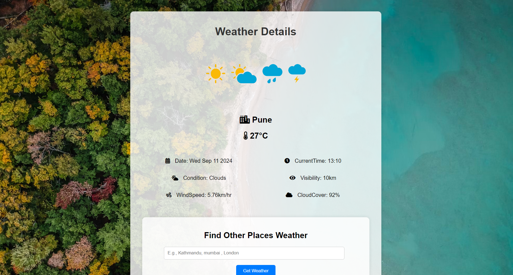

# WeatherApp USING JAVA SERVLET JSP

## Description
WeatherApp is a Java-based web application designed to provide real-time weather updates for a given city. It integrates with the OpenWeatherMap API to fetch and display weather information such as temperature, humidity, wind speed, visibility, cloud cover, and more. The app is built using Java Servlets and JSP to dynamically display the weather data to users.

## Technologies Used
- Java Servlets
- JavaServer Pages (JSP)
- HTML
- CSS
- OpenWeatherMap API

## Screenshots

